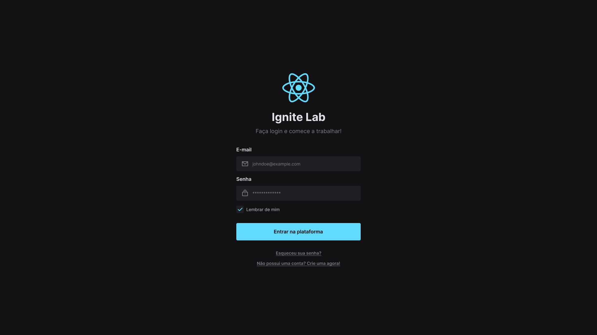

<h1 align="center">
    
</h1>

<h4 align="center"> 
	:heavy_check_mark: Ignite Lab - Design System 🎮🚀 Done! :heavy_check_mark:
</h4>
<p align="center">
  

<a href="https://www.linkedin.com/in/fellipeutaka/">
    
  </a>

<a aria-label="Completed" href="https://lp.rocketseat.com.br/ignite">
    </img>
  </a>

<a href="https://github.com/fellipeutaka/iglab-design-system/commits">
    
  </a>


   <a href="https://github.com/fellipeutaka/iglab-design-system/stargazers">
    
  </a>
</p>
<p align="center">
  <a href="#-iglab">Ignite Lab</a>   |   
  <a href="#-project">Project</a>   |   
  <a href="#rocket-Technologies">Technologies</a>   |   
  <a href="#-layout">Layout</a>   |   
  <a href="#-how-to-use">How to use</a>   |   
  <a href="#-how-to-contribute">How to contribute</a>   |   
  <a href="#memo-license">License</a>   |   
  <a href="https://fellipeutaka.github.io/iglab-design-system/?path=/story/components-button--default">Storybook live demo</a>
</p>

## ℹ️ What's Ignite Lab?

A 100% online, free and hands-on event focused on the front-end, for those who enjoy React and want to specialize even more in this awesome library.

### Stages

- Stage 1: Base Building - ✔️
  - Starting Design System on Figma.
- Stage 2: Coding - ✔️
  - Creating React components and configuring Storybook.
- Stage 3: Deploy - ✔️
  - Configuring CI/CD with Github Actions and deploying Storybook on Github Pages.

## 💻 Project

Creating my first Design System with accessible and reusable components, using Composition and Polymorphism pattern.

<h1 align="center">
    
</h1>

## 🚀 Technologies

This project was developed with the following technologies:

- [TypeScript][ts]
- [Node.js][node]
- [React][react]
- [Vite.js][vite]
- [Storybook][storybook]
- [Stitches][stitches]
- [Radix][radix]

## 🔖 Layout

To access the layout use [Figma][figma].

## ℹ️ How To Use

To clone and run this application, you'll need [Git](git), [Node.js][node] + [Yarn][yarn] installed on your computer.

From your command line:

### Install Front-end

```bash
# Clone this repository
$ git clone https://github.com/fellipeutaka/iglab-design-system

# Install dependencies
$ yarn

# Start server
$ yarn dev

# running on port 5173
```

### Install Storybook

```bash
# Clone this repository
$ git clone https://github.com/fellipeutaka/iglab-design-system

# Install dependencies
$ yarn

# Start storybook
$ yarn storybook

# running on port 6006
```

## 🤔 How to contribute

1. Fork this repository.
2. Create a branch: `git checkout -b <branch_name>`.
3. Make your changes and commit them: `git commit -m '<commit_message>'`
4. Push to original branch: `git push origin <project_name> / <local>`
5. Create the pull request.

Or, see the GitHub documentation on [how to create a pull request](https://help.github.com/en/github/collaborating-with-issues-and-pull-requests/creating-a-pull-request).

## 📝 License

This project is under the MIT license. See the [LICENSE](https://github.com/fellipeutaka/iglab-design-system/blob/master/LICENSE) for details.

Made with ♥ by Fellipe Utaka 👋 [Get in touch!](https://www.linkedin.com/in/fellipeutaka/)

[figma]: https://www.figma.com/file/SFlTxLaAMB6jxvvijYSJIg/Ignite-Lab-Design-System?node-id=0%3A1
[ts]: https://www.typescriptlang.org/
[node]: https://nodejs.org/
[react]: https://reactjs.org
[vite]: https://vitejs.dev/
[storybook]: https://storybook.js.org/
[stitches]: https://stitches.dev/
[radix]: https://www.radix-ui.com/
[git]: https://git-scm.com
[yarn]: https://yarnpkg.com/
